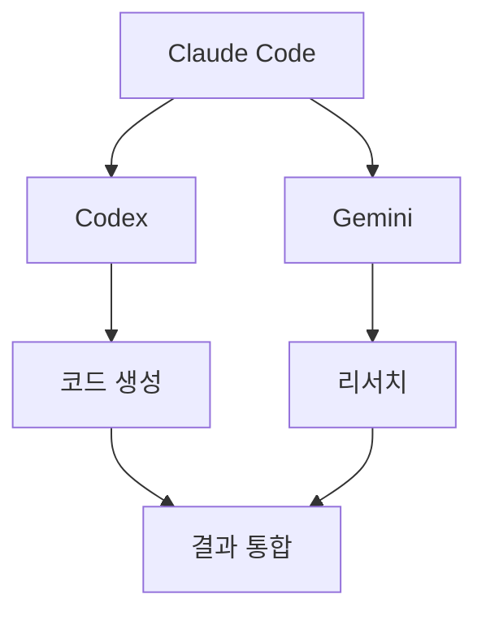

# Arrow SVG 도구 가이드북

> "Arrow 1.0"이라는 단일 확정 제품은 없음.
> 목적에 따라 아래 도구 중 선택.

---

## 도구 분류

### 빠른 SVG 화살표 생성 (노코드)

| 도구 | 특징 | 접근 |
|---|---|---|
| **ppointed (fffuel)** | 모양/색/굵기/화살촉 커스터마이징 → SVG 다운로드 | 웹 무료 |
| **Excalidraw** | 손그림 스타일 협업 다이어그램 → SVG 내보내기 | 웹 무료/오픈소스 |
| **diagrams.net (Draw.io)** | 범용 다이어그램 → SVG 내보내기 | 웹 무료 |

### 개발용 라이브러리

| 라이브러리 | 용도 | 설치 |
|---|---|---|
| **react-xarrows** | React 컴포넌트 간 동적 화살표 연결 | `npm i react-xarrows` |
| **leader-line** | Vanilla JS DOM 요소 간 선/화살표 | `npm i leader-line` |
| **Mermaid.js** | 마크다운 텍스트 → 다이어그램 SVG 렌더링 | `npm i mermaid` |

---

## 활용 시나리오

1. **웹 에셋 제작**: ppointed에서 커스텀 화살표 → SVG 다운로드 → 포트폴리오 삽입
2. **인터랙티브 대시보드**: react-xarrows로 노드 연결 흐름 시각화 (투자봇 전략 흐름도 등)
3. **문서 자동화**: Mermaid.js로 마크다운에 아키텍처 다이어그램 작성 → CI/CD에서 SVG 자동 생성

---

## 오케스트레이션 활용 예시

```markdown
# Mermaid.js로 오케스트레이션 다이어그램 작성


```

→ Notion, GitHub README, 포트폴리오에 바로 임베드 가능

---

## 추천 우선순위

1. **Mermaid.js** — 이미 Notion에서 지원, 오케스트레이션 다이어그램에 바로 활용 가능
2. **Excalidraw** — 빠른 브레인스토밍용
3. **react-xarrows** — 투자봇 대시보드 등 React 프로젝트에 동적 흐름도 필요할 때
